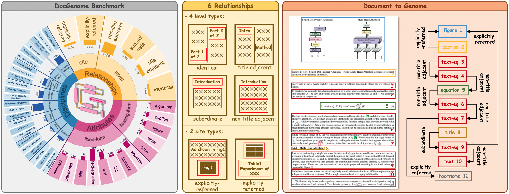
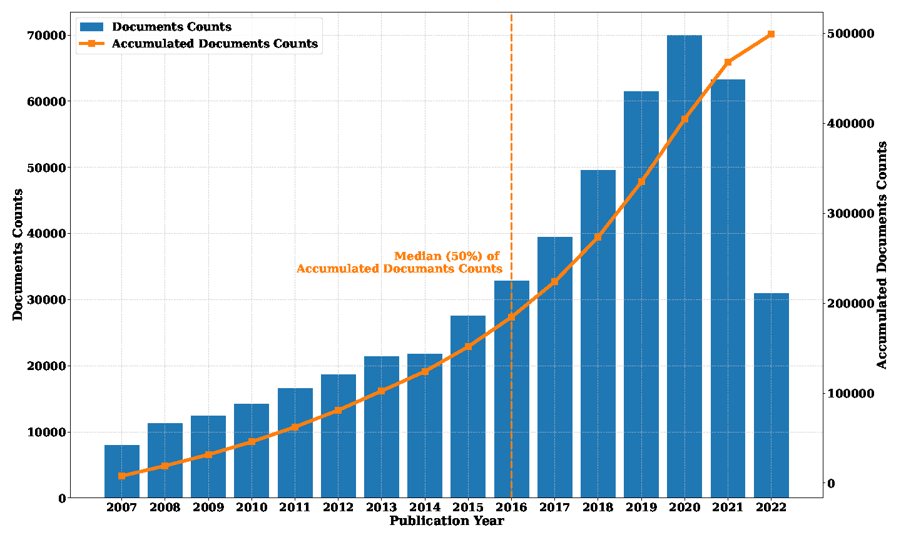
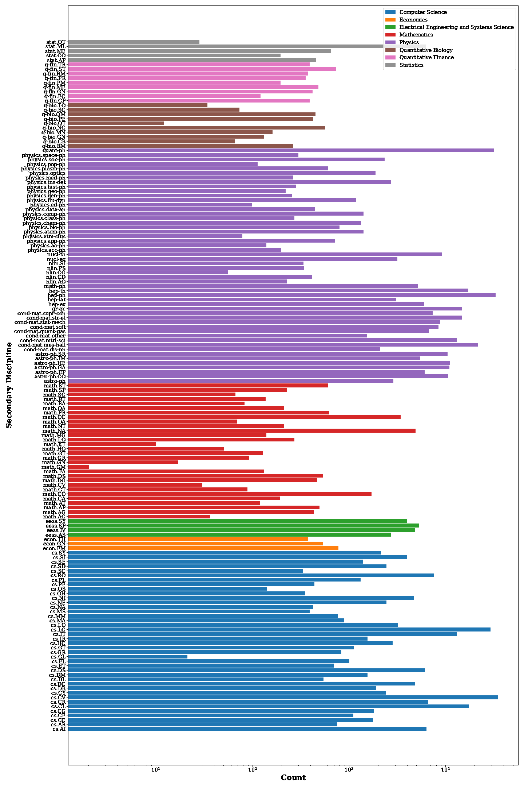
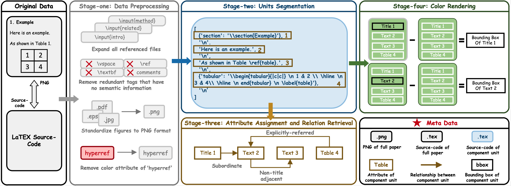
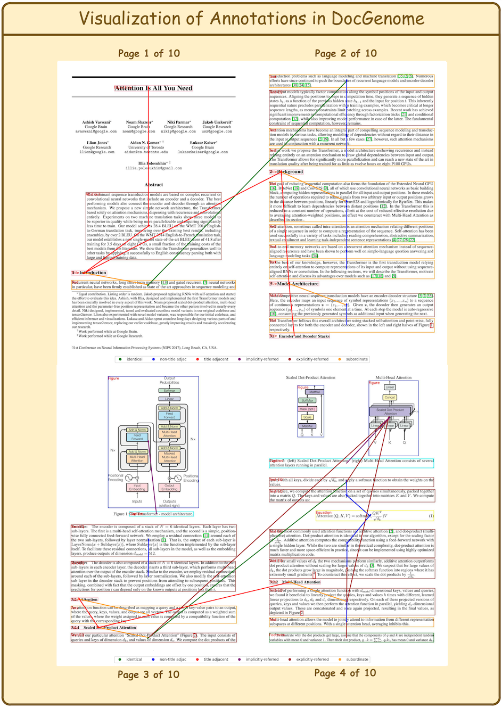
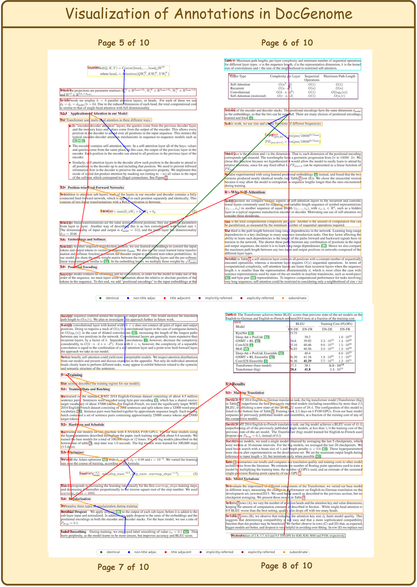
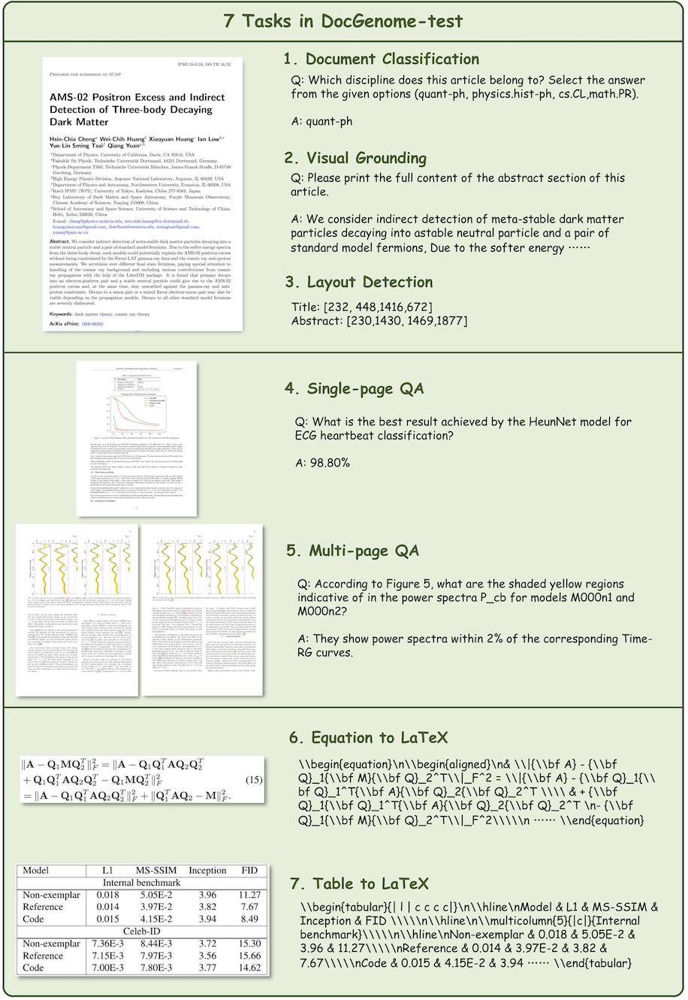

[](https://arxiv.org/abs/2406.11633)
[](https://github.com/UniModal4Reasoning/DocGenome/issues)
[](https://github.com/UniModal4Reasoning/DocGenome/pulls)

# DocGenome: An Open Large-scale Scientific Document Benchmark for Training and Testing Multi-modal Large Language Models

Scientific documents record research findings and valuable human knowledge, comprising a vast corpus of high-quality data. Thus, leveraging multi-modality data extracted from these documents and assessing large models' abilities to handle scientific document-oriented tasks is meaningful. Despite promising advancements, large models still perform poorly on multi-page scientific document extraction and understanding tasks, and their capacity to process within-document data formats such as charts and equations remains under-explored. To address these issues, we present DocGenome, a structured document dataset constructed by annotating 500K scientific documents from 153 disciplines in the arXiv open-access community, using our custom auto-labeling pipeline. DocGenome features four characteristics: 

- 1) Completeness: It is the first dataset to structure data from all modalities including 13 layout attributes along with their \LaTeX\ source codes. 
- 2) Logicality: It provides 6 logical relationships between different entities within each scientific document. 
- 3) Diversity: It covers various document-oriented tasks, including document classification, visual grounding, document layout detection, document transformation, open-ended single-page QA and multi-page QA.  
- 4) Correctness: It undergoes rigorous quality control checks conducted by a specialized team. 

Besides, based on DocGenome, we conduct extensive experiments to demonstrate the advantages of DocGenome and objectively evaluate the performance of current large models on our benchmark.

## Release
- **We will soon provide support for dataset downloads on other platforms**, such as [Huggingface](https://huggingface.co/datasets/U4R/DocGenome). Thank you all for your support of DocGenome.
- [2024/6/15] 🔥 Our paper entitled "DocGenome: An Open Large-scale Scientific Document Benchmark for Training and Testing Multi-modal Large Models" has been released in arXiv [Link]()
- [2024/6/6] 🔥 We have released the DocGenome benchmark, includes 8 subsets as follows: 
    - [docgenome-train-000.tar.gz](https://drive.google.com/file/d/1p6o6naxPgWLvfmBIvmVionBv4ygSV5Sy/view?usp=drive_link)
    - [docgenome-train-001.tar.gz](https://drive.google.com/file/d/16xTMiZb7E-VPUdIU32mA3qNeuZIoIJ-9/view?usp=drive_link)
    - [docgenome-train-002.tar.gz](https://drive.google.com/file/d/1qW64JRqlFzkx1wwMwo8vdsyTUcetH_H2/view?usp=drive_link)
    - [docgenome-train-003.tar.gz](https://drive.google.com/file/d/1JlgHou0JchCn8F4Dspb22YMQRkgHm1dG/view?usp=drive_link)
    - [docgenome-train-004.tar.gz](https://drive.google.com/file/d/1XEuAz1tlo1jzBYk7scSBPbVsf1KqjN6c/view?usp=drive_link)
    - [docgenome-train-005.tar.gz](https://drive.google.com/file/d/1Fz4f9YBRG7Ro7b1uovEKl2pfyizFIq-z/view?usp=drive_link)
    - [docgenome-train-006.tar.gz]()
    - [docgenome-train-007.tar.gz]()

<div align=center>

</div>


## DocGenome Benchmark Introduction

| Datasets                | \# Discipline | \# Category of Units  | \# Pages in Train-set       | \# Pages in Test-set | \# Task    | \# Used Metric | Publication | Entity Relations          |
|------------------------------------------|--------------------------------|-----------------|--------------------|--------------|------------|--------------------|-------------|-----------------|
|                                          |                      
| DocVQA         | -                              | N/A             | 11K                | 1K           | 1          | 2                  | 1960-2000   | ❎     |
| DocLayNet | -                              | 11              | 80K                | 8K           | 1          | 1                  | -           | ❎     |
| DocBank            | -                              | 13              | 0.45M              | **50K** | 3          | 1                  | 2014-2018   | ❎     |
| PubLayNet   | -                              | 5               | 0.34M              | 12K          | 1          | 1                  | -           | ❎     |
| VRDU               | -                              | 10              | 7K                 | 3K           | 3          | 1                  | -           | ❎     |
| DUDE             | -                              | N/A             | 20K                | 6K           | 3          | 3                  | 1860-2022   | ❎     |
| D^4LA             | -                              | **27**    | 8K                 | 2K           | 1          | 3                  | -           | ❎     |
| Fox Benchmark       | -                              | 5               | N/A (No train-set) | 0.2K         | 3          | 5                  | -           | ❎     |
| ArXivCap        | 32                             | N/A             | 6.4M*           | N/A          | 4          | 3                  | -           | ❎    |
| DocGenome (ours)                | **153**                   | 13              | **6.8M**      | 9K           | **7** | **7**         | 2007-2022   | ✅     |


&ensp;
------------------------

### 👇🏻DocGenome-train Download

We provide 8 subsets of DocGenome-train for downloading:

<details>
<summary> Data Download</summary>

- [docgenome-train-000.tar.gz](https://drive.google.com/file/d/1p6o6naxPgWLvfmBIvmVionBv4ygSV5Sy/view?usp=drive_link)
- [docgenome-train-001.tar.gz](https://drive.google.com/file/d/16xTMiZb7E-VPUdIU32mA3qNeuZIoIJ-9/view?usp=drive_link)
- [docgenome-train-002.tar.gz](https://drive.google.com/file/d/1qW64JRqlFzkx1wwMwo8vdsyTUcetH_H2/view?usp=drive_link)
- [docgenome-train-003.tar.gz](https://drive.google.com/file/d/1JlgHou0JchCn8F4Dspb22YMQRkgHm1dG/view?usp=drive_link)
- [docgenome-train-004.tar.gz](https://drive.google.com/file/d/1XEuAz1tlo1jzBYk7scSBPbVsf1KqjN6c/view?usp=drive_link)
- [docgenome-train-005.tar.gz](https://drive.google.com/file/d/1Fz4f9YBRG7Ro7b1uovEKl2pfyizFIq-z/view?usp=drive_link)
- [docgenome-train-006.tar.gz]()
- [docgenome-train-007.tar.gz]()
</details>


### Definition of relationships between component units
DocGenome contains 4 level relation types and 2 cite relation types, as shown in the following table:

| **Name**       | Description         | Example                 |
|--------------------------------------|---------------------------------------------------------|----------------------------------------------------------------------------|
| Identical         | Two blocks share the same source code.                           | Cross-column text; Cross-page text.                                        |
| Title adjacent      | The two titles are adjacent.                                     | (\section\{introduction\}, \section\{method\}) |
| Subordinate        | One block is a subclass of another block.                        | (\section\{introduction\}, paragraph within Introduction)    |
| Non-title adjacent  | The two text or equation blocks are adjacent.                    | (Paragraph 1, Paragraph 2)                                                 |
| Explicitly-referred | One block refers to another block via footnote, reference, etc.  | (As shown in \ref\{Fig: 5\} ..., Figure 5)                   |
| Implicitly-referred | The caption block refers to the corresponding float environment. | (Table Caption 1, Table 1)           
</details>

### Attribute of component units
DocGenome has 13 attributes of component units, which can be categorized into two classes
- **1) Fixed-form units**, including Text, Title, Abstract, etc., which are characterized by sequential reading and hierarchical relationships readily discernible from the list obtained in Stage-two of the designed DocParser.
- **2) Floating-form units**, including Table, Figure, etc., which establish directional references to fixed-form units through commands like \texttt{\textbackslash ref} and \texttt{\textbackslash label}.

| **Index**  | **Category** | **Notes**                           |
|----------------|-------------------|------------------------------------------|
| 0              | Algorithm         |                                          |
| 1              | Caption           | Titles of Images, Tables, and Algorithms |
| 2              | Equation          |                                          |
| 3              | Figure            |                                          |
| 4              | Footnote          |                                          |
| 5              | List              |                                          |
| 7              | Table             |                                          |
| 8              | Text              |                                          |
| 9              | Text-EQ           | Text block with inline equations         |
| 10             | Title             | Section titles                           |
| 12             | PaperTitle        |                                          |
| 13             | Code              |                                          |
| 14             | Abstract          |                                          |


## Types of disciplines

Page distribution of DocGenome. 20\% of documents are five pages or fewer, 50\% are ten pages or fewer, and 80\% are nineteen pages or fewer.
<details>
<summary> Page Distribution</summary>
<div align=center>

</div>

</details>

&ensp;

Distribution of secondary disciplines in our DocGenome. The count on the x-axis represents the number of documents, and documents from the same primary discipline are marked with the same color.

<details>
<summary> Discipline Distribution</summary>
<div align=center>

</div>

</details>


&ensp;
------------------------
## DocParser: A Cutting-edge Auto-labeling Pipeline

<div align=center>

</div>


## Visualizations

<details>
<summary> Visual Example One of annotations in DocGenome</summary>

<div align=center>

</div>

</details>


<details>
<summary> Visual Example One of annotations in DocGenome</summary>

<div align=center>

</div>

</details>

<details>
<summary> Visual examples of document-oriented tasks in DocGenome</summary>

<div align=center>

</div>

</details>

## Citation
If you find our work useful in your research, please consider citing Fox:
```bibtex
@article{xia2024docgenome,
  title={DocGenome: An Open Large-scale Scientific Document Benchmark for Training and Testing Multi-modal Large Language Models},
  author={Xia, Renqiu and Mao, Song and Yan, Xiangchao and Zhou, Hongbin and Zhang, Bo and Peng, Haoyang and Pi, Jiahao and Fu, Daocheng and Wu, Wenjie and Ye, Hancheng and others},
  journal={arXiv preprint arXiv:2406.11633},
  year={2024}
}
```